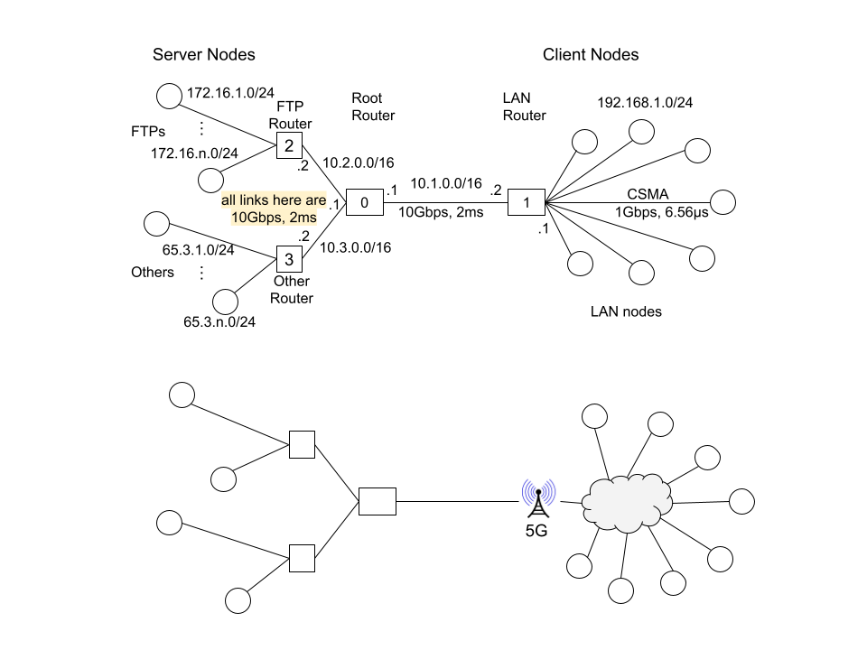

# Simulation Scripts

Majority of the scripts use a common simulated network topology:



To edit the topogy, find the **[original drawing](https://docs.google.com/drawings/d/1AUQNJ594eoBNP_2bAmmXMT4ioOoz7He28ydHSTUjR4s)**
on Google Drive.


Under this `scratch` directory, various scripts with each in its own 
subdirectory are stored.

The scripts under the scratch directory work in either of the two ways:

* A script that has only a single source file in the `scratch` directory

  If the script file is a C++ source file such as `abc.cc`, the name of 
  the script is then `abc` without the suffix of the filename. Another 
  example is the standard `scratch-simulator.cc` that comes with NS3.
  <!--- However, none of my scripts use only a single source file. --->

* A script that uses multiple files in a subdirectory of the `scratch` directory

  In this case, the name of the subdirectory is the name of the script.  For example,
  the standard `subdir` script that comes with NS3.

  **Update**: With the older versions of NS3 based on `waf`, the name of the script 
  in a subdirectory was automatically named after the subdirectory.  This is no 
  longer the case.  The newer CMake based build system looks for the main C++ 
  file and names the script after that file name.  For this reason, in subdirectory 
  `abc`, we will name the main C++ file `abc.cc` so that we will follow the previous 
  convention.

To run a script in a subdirectory, the recommended approach is to go to the script's 
directory in a terminal and run `go.sh` shell script.  Go to any of those subdirectories 
to take a look.

Any data collected will be saved in a subdirectory called `out` in a script's subdirectory.

The following is the list of the scripts:

* cmdline

  An example on using CommandLine class to set simulation parameters 
  through command line. 
  Refer to [this link](https://rainsia.github.io/2018/10/31/ns3-011/).
  See below on how to try it out. More importantly, read the 
  entire document in the link to learn how to use command line 
  facility to easily set simulation parameters in the name of 
  "attributes".

* [000Echo](000Echo/README.md)

  A simple script that starts an echo process between two nodes.  This is just an example 
  for writing simulation scripts including setting up NS logs and enabling PCAP tracing.

* [100Ping](100Ping/README.md)

  A simple script that starts a ping process between two nodes.  Running the script gives the RTT estimates between two nodes.

* [200FTP](200FTP/README.md)

  A script that starts a number FTP downstream flows from FTP server nodes to LAN nodes. 
  This script allows the run of different queue disciplines for comparisons.

* [220TcpBulkSend](220TcpBulkSend/README.md)

  A script that is used to duplicate a TCP throughput issue and to find a solution 
  to it.

## CmdLine Script

First, try this:

```
% ./ns3 run "cmdline --PrintHelp"
 [General Arguments]

General Arguments:
    --PrintGlobals:              Print the list of globals.
    --PrintGroups:               Print the list of groups.
    --PrintGroup=[group]:        Print all TypeIds of group.
    --PrintTypeIds:              Print all TypeIds.
    --PrintAttributes=[typeid]:  Print all attributes of typeid.
    --PrintVersion:              Print the ns-3 version.
    --PrintHelp:                 Print this help message.

```

Read the above command arguments from the help menu and try below:

```
% ./ns3 run "cmdline --PrintGlobals"
Global values:
    --ChecksumEnabled=[false]
        A global switch to enable all checksums for all protocols
    --RngRun=[1]
        The substream index used for all streams
    --RngSeed=[1]
        The global seed of all rng streams
    --SchedulerType=[ns3::MapScheduler]
        The object class to use as the scheduler implementation
    --SimulatorImplementationType=[ns3::DefaultSimulatorImpl]
        The object class to use as the simulator implementation
```

```
% ./ns3 run "cmdline --PrintGroups" 
Registered TypeId groups:
    
    Antenna
    Aodv
    ... ...
    Wifi                  <--
    Wimax
```

```
% ./ns3 run "cmdline --PrintGroup=TrafficControl"
TypeIds in group TrafficControl:
    ns3::CoDelQueueDisc
    ... ...
    ns3::TrafficControlLayer
```

```
% ./ns3 run "cmdline --PrintGroup=Internet"      
TypeIds in group Internet:
    ns3::ArpCache
    ... ...
    ns3::RttEstimator
    ns3::RttMeanDeviation
    ... ...
    ns3::UdpSocket
    ns3::UdpSocketFactory
    ns3::UdpSocketImpl
```

```
% ./ns3 run "cmdline --PrintGroup=Network" 
TypeIds in group Network:
    ns3::Application
    ... ...
    ns3::Tag
    ns3::Trailer
```

Most interestingly, let's see the attributes of a particular TypeId group:

```
% ./ns3 run "cmdline --PrintAttributes=ns3::CoDelQueueDisc"
Attributes for TypeId ns3::CoDelQueueDisc
    --ns3::CoDelQueueDisc::CeThreshold=[+9.22337e+18ns]
        The CoDel CE threshold for marking packets
    --ns3::CoDelQueueDisc::Interval=[100ms]
        The CoDel algorithm interval
    --ns3::CoDelQueueDisc::MaxSize=[1500000B]
        The maximum number of packets/bytes accepted by this queue disc.
    --ns3::CoDelQueueDisc::MinBytes=[1500]
        The CoDel algorithm minbytes parameter.
    --ns3::CoDelQueueDisc::Target=[5ms]
        The CoDel algorithm target queue delay
    --ns3::CoDelQueueDisc::UseEcn=[false]
        True to use ECN (packets are marked instead of being dropped)
    --ns3::CoDelQueueDisc::UseL4s=[false]
        True to use L4S (only ECT1 packets are marked at CE threshold)
Attributes defined in parent class ns3::QueueDisc
    --ns3::QueueDisc::InternalQueueList=[]
        The list of internal queues.
    --ns3::QueueDisc::PacketFilterList=[]
        The list of packet filters.
    --ns3::QueueDisc::QueueDiscClassList=[]
        The list of queue disc classes.
    --ns3::QueueDisc::Quota=[64]
        The maximum number of packets dequeued in a qdisc run
```

